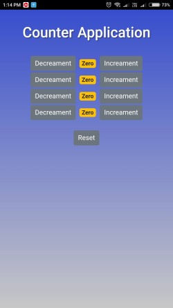
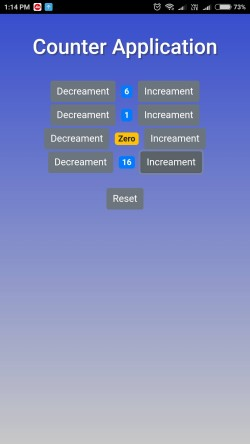

# Counter Application 
### Developed using React

A web application in which you can increase and decrease the value of counters. After clicking on reset it will reset to zero.

### Screenshots

### How to Run 

Download this repository:
`git clone https://github.com/IshanJawade/react-counter-app.git`

go in the downloaded repository:\
`cd react-counter-app-master/`

Dowanload dependencies:\
`npm i `

Start the app on your localhost:\
`npm start`

To see output open your favorite browser and type:\
http://localhost:3000
